# Any-MCP System Architecture

## Architecture Flow Chart

```mermaid
---
title: Any-MCP Extensible Architecture - Third Party Integration Ready
---
graph TB
    %% User Interfaces
    User[👤 User]
    CLI[🖥️ Rich CLI Interface]
    WebAPI[🌐 Web API<br/>FastAPI]
    NotionCLI[📔 Notion CLI<br/>Rich Interface]
    
    %% Third Party Integrations
    subgraph "🔌 Third Party Integrations"
        ThirdPartyApp[🏢 Third Party<br/>Applications]
        CustomUI[🎨 Custom UI<br/>Implementations]
        ExternalTools[🛠️ External Tools<br/>& Scripts]
    end
    
    %% Core Application Layer
    subgraph "🎯 Application Layer"
        MainApp[📱 Main Application<br/>any_mcp.main]
        CliApp[⌨️ CLI Application<br/>any_mcp.core.cli]
        CliChat[💬 CLI Chat<br/>any_mcp.core.cli_chat]
        Chat[🗨️ Core Chat<br/>any_mcp.core.chat]
    end
    
    %% LLM Services
    subgraph "🤖 LLM Services"
        Claude[🧠 Claude<br/>Anthropic API]
        Gemini[✨ Gemini<br/>Google API]
        CustomLLM[🔧 Custom LLM<br/>Third Party Models]
    end
    
    %% MCP Management Layer
    subgraph "⚙️ MCP Management"
        MCPManager[🎛️ MCP Manager<br/>Lifecycle & Health]
        MCPInstaller[📦 MCP Installer<br/>Configuration]
        ServerConnector[🔗 Server Connector<br/>Connection Handler]
        PluginManager[🔌 Plugin Manager<br/>Third Party Extensions]
    end
    
    %% Core MCP Layer - Extensible
    subgraph "🔧 MCP Core - Extensible Framework"
        MCPClient[🖇️ MCP Client<br/>🔓 Open Protocol Handler]
        ToolManager[🛠️ Tool Manager<br/>🔓 Plugin Architecture]
        ErrorHandler[⚠️ Error Handler<br/>🔓 Configurable]
        ProtocolAdapter[🔄 Protocol Adapter<br/>🔓 Custom Protocols]
    end
    
    %% Official MCP Servers
    subgraph "🏪 Official MCP Servers"
        NotionMCP[📔 Notion MCP<br/>Official Server]
        CalcMCP[🔢 Calculator MCP<br/>Demo Server]
        GitHubMCP[🐙 GitHub MCP<br/>Docker Server]
    end
    
    %% Third Party MCP Servers
    subgraph "🌍 Third Party MCP Servers"
        SlackMCP[💬 Slack MCP<br/>🔌 Community Built]
        DBMCP[🗃️ Database MCP<br/>🔌 Custom Integration]
        APMCP[📊 Analytics MCP<br/>🔌 Third Party Tool]
        CustomMCP[🔧 Your Custom MCP<br/>🔌 Build Your Own]
    end
    
    %% Third Party Client Extensions
    subgraph "🔧 Third Party Client Extensions"
        CustomClient[🏗️ Custom MCP Client<br/>🔌 Your Implementation]
        ClientSDK[📚 Client SDK<br/>🔌 Integration Library]
        APIWrapper[🌐 API Wrapper<br/>🔌 Language Bindings]
    end
    
    %% External APIs & Services
    subgraph "🌐 External APIs & Services"
        NotionAPI[📔 Notion API]
        GitHubAPI[🐙 GitHub API]
        AnthropicAPI[🧠 Anthropic API]
        GoogleAPI[✨ Google API]
        ThirdPartyAPI[🔌 Third Party APIs<br/>Slack, Discord, etc.]
        CustomAPI[🏢 Enterprise APIs<br/>Internal Systems]
    end
    
    %% Configuration & Extensions
    subgraph "📋 Configuration & Extensions"
        ConfigYAML[📄 mcp_config.yaml<br/>🔓 Server Configuration]
        EnvFile[🔐 .env<br/>🔓 API Keys & Secrets]
        PluginConfig[🔌 plugin_config.yaml<br/>🔓 Third Party Settings]
        MCPRegistry[📦 MCP Registry<br/>🔓 Community Servers]
    end
    
    %% User Interactions
    User --> CLI
    User --> WebAPI
    User --> NotionCLI
    ThirdPartyApp --> WebAPI
    ThirdPartyApp --> CustomClient
    CustomUI --> MCPClient
    ExternalTools --> ClientSDK
    
    %% CLI Flow
    CLI --> CliApp
    CliApp --> CliChat
    CliChat --> Chat
    NotionCLI --> NotionMCP
    
    %% Main Application Flow
    CLI --> MainApp
    WebAPI --> MainApp
    ThirdPartyApp --> MainApp
    MainApp --> MCPManager
    
    %% MCP Management Flow
    MCPManager --> MCPClient
    MCPManager --> CustomClient
    MCPManager --> MCPInstaller
    MCPManager --> ServerConnector
    MCPManager --> PluginManager
    MCPInstaller --> ConfigYAML
    PluginManager --> PluginConfig
    
    %% Core MCP Flow - Extensible
    MCPClient --> ToolManager
    MCPClient --> ErrorHandler
    MCPClient --> ProtocolAdapter
    CustomClient --> ProtocolAdapter
    Chat --> MCPClient
    Chat --> CustomClient
    ClientSDK --> MCPClient
    APIWrapper --> MCPClient
    
    %% LLM Integration
    Chat --> Claude
    Chat --> Gemini
    Chat --> CustomLLM
    CliChat --> Claude
    CliChat --> Gemini
    
    %% Official MCP Server Connections
    MCPClient --> NotionMCP
    MCPClient --> CalcMCP
    MCPClient --> GitHubMCP
    
    %% Third Party MCP Server Connections
    MCPClient --> SlackMCP
    MCPClient --> DBMCP
    MCPClient --> APMCP
    MCPClient --> CustomMCP
    CustomClient --> SlackMCP
    CustomClient --> CustomMCP
    
    %% External API Connections
    NotionMCP --> NotionAPI
    GitHubMCP --> GitHubAPI
    SlackMCP --> ThirdPartyAPI
    DBMCP --> CustomAPI
    APMCP --> ThirdPartyAPI
    CustomMCP --> CustomAPI
    Claude --> AnthropicAPI
    Gemini --> GoogleAPI
    CustomLLM --> ThirdPartyAPI
    
    %% Configuration Loading
    ConfigYAML --> MCPInstaller
    PluginConfig --> PluginManager
    EnvFile --> NotionMCP
    EnvFile --> Claude
    EnvFile --> Gemini
    EnvFile --> GitHubMCP
    EnvFile --> SlackMCP
    EnvFile --> CustomMCP
    MCPRegistry --> MCPInstaller
    
    %% Extension Points
    MCPRegistry --> SlackMCP
    MCPRegistry --> DBMCP
    MCPRegistry --> APMCP
    
    %% Styling
    classDef userInterface fill:#e1f5fe,stroke:#01579b,stroke-width:2px
    classDef thirdParty fill:#fff3e0,stroke:#e65100,stroke-width:3px
    classDef application fill:#f3e5f5,stroke:#4a148c,stroke-width:2px
    classDef llm fill:#fff3e0,stroke:#e65100,stroke-width:2px
    classDef management fill:#e8f5e8,stroke:#2e7d32,stroke-width:2px
    classDef coreExtensible fill:#fff8e1,stroke:#f57c00,stroke-width:3px
    classDef officialServers fill:#fce4ec,stroke:#c2185b,stroke-width:2px
    classDef thirdPartyServers fill:#e8f5e8,stroke:#2e7d32,stroke-width:3px
    classDef thirdPartyClients fill:#f1f8e9,stroke:#558b2f,stroke-width:3px
    classDef external fill:#f1f8e9,stroke:#558b2f,stroke-width:2px
    classDef config fill:#f9fbe7,stroke:#827717,stroke-width:2px
    
    class User,CLI,WebAPI,NotionCLI userInterface
    class ThirdPartyApp,CustomUI,ExternalTools thirdParty
    class MainApp,CliApp,CliChat,Chat application
    class Claude,Gemini,CustomLLM llm
    class MCPManager,MCPInstaller,ServerConnector,PluginManager management
    class MCPClient,ToolManager,ErrorHandler,ProtocolAdapter coreExtensible
    class NotionMCP,CalcMCP,GitHubMCP officialServers
    class SlackMCP,DBMCP,APMCP,CustomMCP thirdPartyServers
    class CustomClient,ClientSDK,APIWrapper thirdPartyClients
    class NotionAPI,GitHubAPI,AnthropicAPI,GoogleAPI,ThirdPartyAPI,CustomAPI external
    class ConfigYAML,EnvFile,PluginConfig,MCPRegistry config
```

## Architecture Overview

This diagram illustrates the extensible architecture of Any-MCP, highlighting the key integration points for third-party development:

### 🔌 Third-Party Integration Points

1. **Custom MCP Clients** - Build your own client implementations
2. **Custom MCP Servers** - Create domain-specific servers  
3. **Plugin System** - Extend core functionality
4. **SDK & API Wrappers** - Language bindings for integration
5. **Community Registry** - Share and discover MCP servers

### 🎯 Key Architectural Layers

- **User Interface Layer**: Multiple interfaces (CLI, Web API, Custom UIs)
- **Application Layer**: Core chat and tool orchestration
- **LLM Services**: Multi-provider support with extensibility
- **MCP Management**: Lifecycle management with plugin support
- **MCP Core**: Extensible protocol handling framework
- **Server Ecosystem**: Official and third-party MCP servers

### 🌍 Extensibility Features

- **🔓 Open Protocol Handlers** - Customize MCP communication
- **🔌 Plugin Architecture** - Extend tool management and error handling
- **🏗️ Custom Implementations** - Build your own clients and servers
- **📦 Community Registry** - Discover and share MCP components
