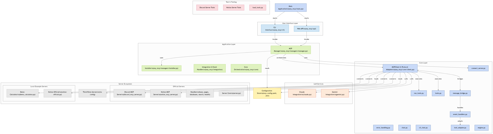

# Project Structure



This project now follows Python packaging best practices:

## Directory Structure

```
any-mcp/
├── pyproject.toml          # Project configuration and dependencies
├── main.py                 # Entry point script
├── README.md              # Project documentation
├── LICENSE                # MIT License
├── VERSION                # Version tracking
├── any_mcp/               # Main package
│   ├── __init__.py        # Package initialization
│   ├── main.py            # Core application logic
│   ├── core/              # Core functionality
│   │   ├── __init__.py
│   │   ├── client.py      # MCP client (was mcp_client.py)
│   │   ├── claude.py      # Claude LLM integration
│   │   ├── gemini.py      # Gemini LLM integration
│   │   ├── chat.py        # Chat functionality
│   │   ├── cli_chat.py    # CLI chat interface
│   │   ├── cli.py         # CLI application
│   │   ├── tools.py       # Tool management
│   │   └── error_handling.py
│   ├── api/               # Web API
│   │   ├── __init__.py
│   │   └── web_mcp.py     # FastAPI web interface
│   ├── managers/          # MCP management
│   │   ├── __init__.py
│   │   ├── manager.py     # MCP manager (was mcp_manager.py)
│   │   └── installer.py   # MCP installer (was mcp_installer.py)
│   ├── servers/           # MCP servers
│   │   ├── __init__.py
│   │   ├── connect_server.py    # Server connector
│   ├── cli/               # CLI interface
│   │   ├── __init__.py
│   │   └── main.py        # CLI main (was any_mcp_cli.py)
│   └── adapters/          # Future adapters
│       └── __init__.py
├── config/                # Configuration files
│   ├── mcp_config.yaml    # MCP configuration
│   └── example_mcp_config.yaml
├── examples/              # (optional) Example scripts
├── tests/                 # Test suite
│   ├── __init__.py
│   ├── unit/              # Unit tests
│   ├── integration/       # Integration tests
│   ├── fixtures/          # Test fixtures
│   └── test_*.py          # Test files
├── scripts/               # Utility scripts
│   └── *.sh               # Shell scripts
└── docs/                  # Documentation
```

## Key Changes

1. **Package Structure**: All source code moved to `any_mcp/` package
2. **Import Updates**: All imports updated to use proper package paths
3. **Configuration**: Config files moved to `config/` directory
4. **Examples**: Demo files moved to `examples/` directory
5. **Tests**: Test files organized in `tests/` directory with subfolders
6. **Scripts**: Shell scripts moved to `scripts/` directory

## Entry Points

- **Main Application**: `python main.py` or `any-mcp` command
- **CLI Tool**: `any-mcp-cli` command
- **Web Server**: `mcp-server` command

## Installation

```bash
pip install -e .  # Development installation
# or
pip install .     # Standard installation
```

## Usage

```python
from any_mcp import MCPClient, MCPManager

# Use the package components
manager = MCPManager()
```

This structure follows Python packaging standards and makes the project more maintainable and professional.

## Special Thanks

This project's structure and clarity have been significantly inspired by the excellent work of [Ahmed Khaleel](https://ahmedkhaleel.dev/) and his amazing project, [GitDiagram](https://gitdiagram.com/), which visualizes GitHub repositories. Their dedication to well-structured and understandable projects is truly commendable.