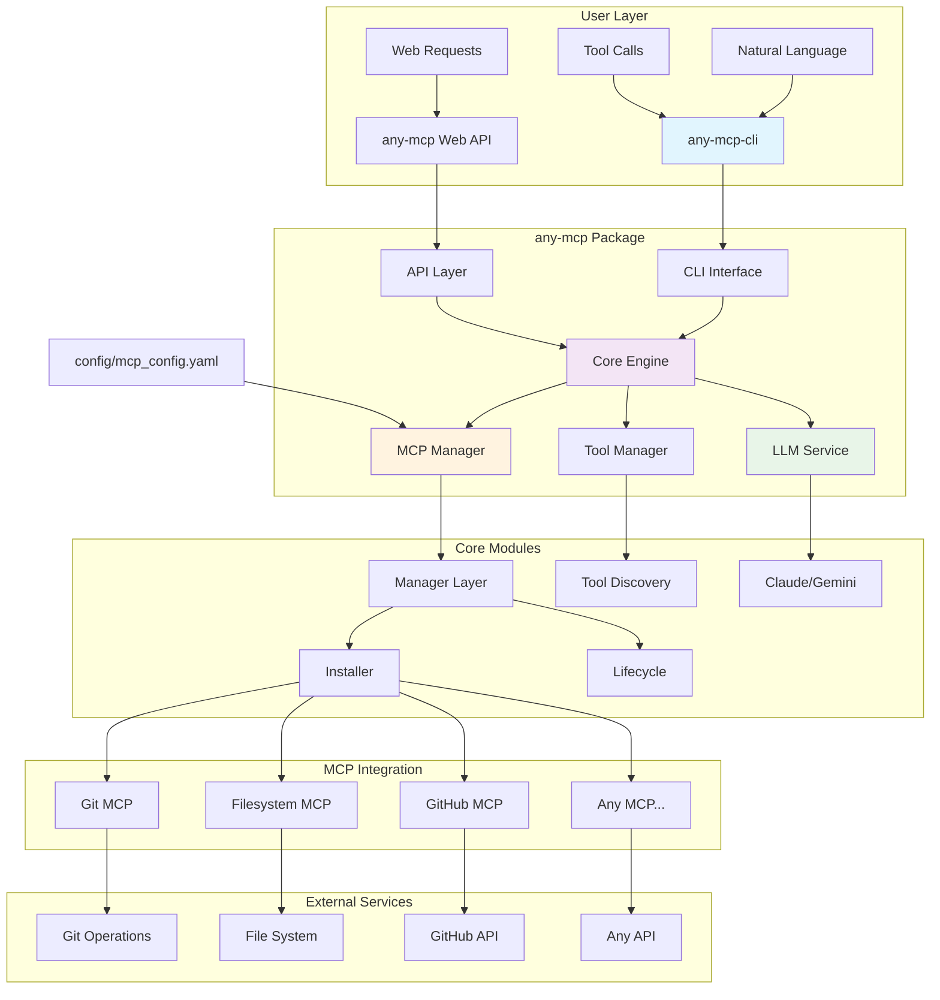

# any-mcp

A universal adapter that safely starts any MCP package, discovers available tools, and provides a unified interface for users and LLMs to interact with them through a single, standardized API.

> **Production Release v1.0.0** - Ready for enterprise deployment with full MCP protocol compliance, multi-LLM support, and comprehensive Notion API integration featuring 30+ tools.

## Mission

Build **one adapter layer** that lets LLMs plug-and-play with *any* third-party MCP found on the internet—no bespoke coding required each time.

## Key Features

- **🗣️ Natural Language Interface**: Talk to any MCP using plain English - no API knowledge needed
- **🔄 Universal Adapter**: One interface for all MCPs regardless of underlying implementation  
- **🔍 Auto-Discovery**: Automatically detect and catalog available tools from any MCP
- **📦 Multi-Source Installation**: Install MCPs from Docker, local files, Python modules, or Git repositories
- **🎨 Rich Interactive CLI**: Beautiful command-line interface with colorful output and real-time feedback
- **🌐 Web API**: RESTful interface for remote MCP management and tool calling
- **🤖 Multi-LLM Support**: Claude and Gemini integration for advanced natural language processing
- **📊 Complete Notion Integration**: 30+ tools covering Pages, Databases, Blocks, Users, Comments, Files, and Search
- **🔧 Production Ready**: Configuration management, health monitoring, error handling, and logging

## Architecture



### Core Components

1. **🎯 CLI Interface** (`any_mcp/cli/main.py`) - Polished command-line interface with 8 main commands:
   - `list` - List configured MCP servers and their status
   - `install` - Install MCPs from multiple sources (Docker, local, module)
   - `start/stop` - Lifecycle management for MCP servers
   - `tools` - Discover available tools from any MCP server
   - `call` - Direct tool execution with structured arguments
   - `chat` - Interactive chat mode with LLM integration
   - `nl` - Natural language command processing

2. **⚙️ Core Engine** (`any_mcp/main.py`) - Main application logic and MCP orchestration
3. **📊 MCP Manager** (`any_mcp/managers/manager.py`) - Lifecycle management, health monitoring, and tool orchestration
4. **📦 MCP Installer** (`any_mcp/managers/installer.py`) - Multi-source installation supporting:
   - Docker images (`docker://image:tag`)
   - Local scripts (`local://path/to/script.py`)
   - Python modules (`module://package-name`)
   - Git repositories (planned)

5. **🔌 MCP Client** (`any_mcp/core/client.py`) - Enhanced client with tool discovery and calling capabilities
6. **🌐 Web API** (`any_mcp/api/web_mcp.py`) - FastAPI-based HTTP interface for remote operations
7. **🤖 LLM Integration** (`any_mcp/core/claude.py`, `any_mcp/core/gemini.py`) - Multi-LLM support for natural language processing
8. **🛠️ Tool Management** (`any_mcp/core/tools.py`) - Centralized tool discovery and management
9. **💬 Chat Interface** (`any_mcp/core/chat.py`, `any_mcp/core/cli_chat.py`) - Interactive conversation management
10. **🔗 Server Connector** (`any_mcp/servers/connect_server.py`) - Flexible server connection interface

## Quick Start

### Installation

```bash
# Clone the repository
git clone https://github.com/chi-n-nguyen/any-mcp.git
cd any-mcp

# Install dependencies
pip install -e .

# Copy example configuration
cp yaml_config/example_mcp_config.yaml yaml_config/mcp_config.yaml

# Set environment variables (optional for enhanced features)
export GITHUB_TOKEN=your_github_token_here
export NOTION_API_TOKEN=your_notion_token_here
export ANTHROPIC_API_KEY=your_claude_key_here  # For LLM features
export USE_UV=1  # Use uv for faster Python execution
```

### 🎨 Rich Interactive Notion CLI

Experience the flagship feature - a beautiful, interactive interface for Notion with **30+ tools**:

```bash
# Run the rich Notion CLI
python3 notion_cli.py

# Available commands:
#   search <query> - Search across all Notion content
#   page <id> - Get detailed page content
#   health - Check API connection status
#   help - Show complete tool capabilities
#   quit - Exit CLI
```

**Rich CLI Features:**
- 🎨 **Beautiful UI**: Colorful tables, panels, and status indicators
- 📊 **Complete Coverage**: 30+ tools across Pages, Databases, Blocks, Users, Comments, Files, Search
- 🔍 **Real-time Search**: Interactive search across your entire Notion workspace
- 📄 **Rich Details**: Comprehensive page and database information display
- 💚 **Health Monitoring**: Connection status with detailed user information
- 🚀 **Production Ready**: Full Notion API implementation for enterprise use

### Quick Start with v1.0.0 Release

```bash
# Download the latest release
wget https://github.com/chi-n-nguyen/any-mcp/archive/refs/tags/v1.0.0.tar.gz
tar -xzf v1.0.0.tar.gz
cd any-mcp-1.0.0

# Install and run
pip install -e .
python main.py
```

### 🚀 Basic Usage

#### 1. 🎯 Core CLI Commands

```bash
# List all configured MCP servers
python3 -m any_mcp.cli.main list

# Install MCPs from various sources
python3 -m any_mcp.cli.main install --name notion --source local://examples/notion_mcp_server.py --desc "Notion API integration"
python3 -m any_mcp.cli.main install --name github --source docker://ghcr.io/github/github-mcp-server --desc "GitHub operations"

# Start/stop MCP servers
python3 -m any_mcp.cli.main start --server notion
python3 -m any_mcp.cli.main tools --server notion
python3 -m any_mcp.cli.main stop --server notion

# Direct tool calls
python3 -m any_mcp.cli.main call --server notion --tool search_notion --args query="project documentation"
python3 -m any_mcp.cli.main call --script examples/notion_mcp_server.py --tool health_check

# Natural language interface (AI-powered)
python3 -m any_mcp.cli.main nl --server notion --query "search for all pages about AI projects"

# Interactive chat mode
python3 -m any_mcp.cli.main chat --server notion
```

#### 2. 🎨 Interactive Rich CLI (Recommended)

```bash
# Launch the beautiful Notion interface
python3 notion_cli.py

# Commands within the interface:
#   search <query> - Find content across Notion
#   page <page-id> - Get detailed page information  
#   health - Check connection and API status
#   help - Show all 30+ available tools
```

#### 3. Web API Server

```bash
# Start the web API server
python -m any_mcp.api.web_mcp

# Or use uvicorn directly
uvicorn any_mcp.api.web_mcp:app --host 0.0.0.0 --port 8000 --reload
```

#### 4. Programmatic Usage

```python
from any_mcp.managers.manager import MCPManager
from any_mcp.managers.installer import MCPInstaller

# Install an MCP
installer = MCPInstaller()
installer.install_mcp(
    name="github",
    source="docker://ghcr.io/github/github-mcp-server",
    env_vars={"GITHUB_TOKEN": "your_token"}
)

# Use the MCP
async with MCPManager() as manager:
    # List available tools
    tools = await manager.list_mcp_tools("github")
    
    # Call a tool
    result = await manager.call_mcp(
        "github", 
        "search_repositories", 
        {"query": "mcp language:python"}
    )
```

### Web API Examples

```bash
# List all MCPs
curl http://localhost:8000/mcp

# Install a new MCP (example: Git MCP)
curl -X POST http://localhost:8000/mcp/install \
  -H "Content-Type: application/json" \
  -d '{
    "name": "git",
    "source": "module://mcp_server_git",
    "description": "Git operations via MCP"
  }'

# Call a tool (example)
curl -X POST http://localhost:8000/mcp/git/call \
  -H "Content-Type: application/json" \
  -d '{
    "tool_name": "git_status",
    "args": {"repo_path": "."}
  }'

# Check MCP health
curl http://localhost:8000/mcp/git/health
```

## 📋 Configuration

Create a `yaml_config/mcp_config.yaml` file to define your MCPs. The system comes with pre-configured examples:

```yaml
installed_mcps:
  # GitHub Integration
  github:
    type: "docker"
    source: "ghcr.io/github/github-mcp-server"
    description: "GitHub's official MCP server for repository operations"
    env_vars:
      GITHUB_PERSONAL_ACCESS_TOKEN: "${GITHUB_TOKEN}"
      GITHUB_TOOLSETS: "all"
    enabled: true

  # Notion Integration (30+ tools)
  notion:
    type: "local"
    source: "./examples/notion_mcp_server.py"
    description: "Complete Notion API implementation with 30+ tools"
    env_vars:
      NOTION_API_TOKEN: "${NOTION_API_TOKEN}"
    enabled: true

  # Calculator Demo
  calculator:
    type: "local"
    source: "./mcps/demo_calculator.py"
    description: "Simple calculator MCP for mathematical operations"
    env_vars: {}
    enabled: true

  # Add your custom MCPs here
  # my_service:
  #   type: "local"
  #   source: "./my_custom_mcp.py"
  #   description: "My custom service integration"
  #   env_vars:
  #     API_KEY: "${MY_SERVICE_API_KEY}"
  #   enabled: true
```

## 📦 Supported MCP Sources

### 1. Local Script MCPs (Recommended for Development)
```bash
# Use local Python scripts directly
python3 -m any_mcp.cli.main call --script examples/notion_mcp_server.py --tool search_notion --args query="projects"
python3 -m any_mcp.cli.main nl --script examples/notion_mcp_server.py --query "find all pages about AI"
```

### 2. Docker MCPs (Production Ready)
```bash
# Install from Docker registry
python3 -m any_mcp.cli.main install --name github --source docker://ghcr.io/github/github-mcp-server
python3 -m any_mcp.cli.main call --docker ghcr.io/github/github-mcp-server --tool search_repos --args query=python
```

### 3. Python Module MCPs (Community MCPs)
```bash
# Use community MCP packages
pip install mcp-server-git
python3 -m any_mcp.cli.main call --module mcp_server_git --tool git_status --args repo_path=.
python3 -m any_mcp.cli.main nl --module mcp_server_git --query "show git status"
```

### 4. Configured Server MCPs (Managed)
```bash
# Use pre-configured servers from mcp_config.yaml
python3 -m any_mcp.cli.main start --server notion
python3 -m any_mcp.cli.main call --server notion --tool search_notion --args query="documentation"
```

## 🎯 Examples and Demos

### 🚀 Flagship Notion Demo

Experience the complete power of the any-mcp system:

```bash
# Interactive rich CLI (recommended)
python3 notion_cli.py

# Or use direct CLI commands
python3 -m any_mcp.cli.main call --script examples/notion_mcp_server.py --tool search_notion --args query="AI projects"
python3 -m any_mcp.cli.main nl --script examples/notion_mcp_server.py --query "find all pages about documentation"
```

### 🔧 Community MCP Integration

Install and use any MCP from the [official servers repository](https://github.com/modelcontextprotocol/servers):

```bash
# Git operations
pip install mcp-server-git
python3 -m any_mcp.cli.main call --module mcp_server_git --tool git_status --args repo_path=.

# Filesystem operations  
pip install mcp-server-filesystem
python3 -m any_mcp.cli.main call --module mcp_server_filesystem --tool read_file --args path=README.md

# Database operations
pip install mcp-server-sqlite
python3 -m any_mcp.cli.main call --module mcp_server_sqlite --tool execute_query --args query="SELECT * FROM users"

# Pre-configured server management
python3 -m any_mcp.cli.main list
python3 -m any_mcp.cli.main tools --server notion
python3 -m any_mcp.cli.main call --server notion --tool search_notion --args query="project notes"
```

### 🧮 Calculator Demo

Simple example for learning MCP development:

```bash
python3 -m any_mcp.cli.main call --script mcps/demo_calculator.py --tool add --args a=5,b=3
```

## Error Handling and Resilience

The system includes comprehensive error handling:

- **Custom Exception Types**: Specific exceptions for different error scenarios
- **Retry Logic**: Automatic retries with exponential backoff
- **Circuit Breakers**: Prevent cascading failures
- **Timeout Protection**: Configurable timeouts for all operations
- **Error Aggregation**: Collect and analyze errors for monitoring

## API Documentation

When running the web API, visit:
- **API Docs**: http://localhost:8000/docs
- **ReDoc**: http://localhost:8000/redoc
- **Health Check**: http://localhost:8000/health

## Building Your Own MCP Server

### 🚀 Flagship Example: Complete Notion Integration

The repository features a **production-ready Notion MCP implementation** at `examples/notion_mcp_server.py` with **30+ tools** covering the entire Notion API. This serves as the flagship example demonstrating enterprise-grade MCP development.

**🎨 Try the Rich CLI**: Run `python3 notion_cli.py` for a beautiful, interactive interface showcasing the full power of the any-mcp system!

**📊 Complete API Coverage:**
- **📄 Pages** (5 tools): Create, Read, Update, Delete, Move
- **🗄️ Databases** (5 tools): Create, Read, Update, Delete, Query  
- **🧱 Blocks** (6 tools): Create, Read, Update, Delete, Children, Append
- **👥 Users** (3 tools): Get User, Get Users, Get Me
- **💬 Comments** (2 tools): Create, Read Comments
- **📎 Files** (1 tool): Upload Files
- **🔍 Search** (2 tools): Basic Search, Advanced Search
- **💚 Health** (1 tool): Connection Status

This implementation demonstrates how to build **enterprise-ready MCP servers** with comprehensive API coverage.

#### Key Components Demonstrated

1. **Server Setup and JSON-RPC Handling**
   - Proper MCP protocol implementation
   - Tool registration and discovery
   - Request routing and error handling

2. **External API Integration**
   - Environment variable configuration
   - HTTP client setup with proper headers
   - API error handling and response parsing

3. **Tool Implementation Patterns**
   - Input validation and schema definition
   - Async operation handling
   - Structured response formatting

#### Following the Example

**Step 1: Copy the Template**
```bash
cp examples/notion_mcp_server.py examples/your_service_mcp_server.py
```

**Step 2: Modify for Your Service**
- Replace Notion API calls with your service's API
- Update tool definitions in `__init__`
- Modify authentication headers and endpoints
- Implement your specific business logic

**Step 3: Test Your Implementation**
```bash
# Set your service's environment variables
export YOUR_SERVICE_API_KEY=your_api_key

# Test with any-mcp-cli
any-mcp-cli call --script examples/your_service_mcp_server.py --tool your_tool --args key=value
```

#### Common Patterns to Follow

**Tool Registration:**
```python
self.tools = [
    {
        "name": "your_tool_name",
        "description": "Clear description of what this tool does",
        "inputSchema": {
            "type": "object",
            "properties": {
                "required_param": {
                    "type": "string",
                    "description": "Description of this parameter"
                }
            },
            "required": ["required_param"]
        }
    }
]
```

**API Integration:**
```python
async def your_tool_method(self, param: str) -> Dict[str, Any]:
    """Your tool implementation."""
    try:
        response = requests.get(
            f"{YOUR_API_BASE_URL}/endpoint",
            headers=self.get_headers(),
            timeout=30
        )
        
        if response.status_code == 200:
            return {
                "success": True,
                "data": response.json()
            }
        else:
            return {
                "error": f"API error: {response.status_code}",
                "details": response.text
            }
    except Exception as e:
        return {"error": f"Request failed: {str(e)}"}
```

**Request Handling:**
```python
elif method == "tools/call":
    tool_name = params.get("name")
    arguments = params.get("arguments", {})
    
    if tool_name == "your_tool":
        result = await self.your_tool_method(arguments.get("param"))
    else:
        # Handle unknown tool error
```

#### Services to Implement

Use the Notion example as a template for these common integrations:

**Communication Platforms:**
- Slack MCP (channels, messages, users)
- Discord MCP (servers, channels, webhooks)
- Microsoft Teams MCP (teams, channels, chats)

**Project Management:**
- Jira MCP (issues, projects, boards)
- Linear MCP (issues, teams, projects)
- GitHub Issues MCP (issues, PRs, repositories)

**Databases:**
- PostgreSQL MCP (queries, schema, data)
- MongoDB MCP (collections, documents, aggregations)
- Redis MCP (keys, values, pub/sub)

**Cloud Services:**
- AWS MCP (EC2, S3, Lambda)
- GCP MCP (Compute, Storage, Functions)
- Azure MCP (VMs, Blob Storage, Functions)

#### Testing Your MCP

1. **Unit Testing**: Test individual tool methods
2. **Integration Testing**: Test with `any-mcp-cli`
3. **End-to-End Testing**: Test through the web API

```bash
# Test tool listing
any-mcp-cli call --script examples/your_mcp.py --tool health_check

# Test specific functionality
any-mcp-cli call --script examples/your_mcp.py --tool your_main_tool --args param=test

# Test with natural language
any-mcp-cli nl --script examples/your_mcp.py --query "do something with test data"
```

## Development

### 📁 Project Structure

```
any-mcp/
├── any_mcp/                    # Main package
│   ├── api/                    # 🌐 Web API implementation
│   │   └── web_mcp.py          # FastAPI server
│   ├── cli/                    # 🎯 Command-line interface
│   │   └── main.py             # Main CLI with 8 commands
│   ├── core/                   # ⚙️ Core functionality
│   │   ├── client.py           # MCP client implementation
│   │   ├── chat.py             # Chat interface
│   │   ├── claude.py           # Claude LLM integration
│   │   ├── gemini.py           # Gemini LLM integration
│   │   ├── tools.py            # Tool management
│   │   └── error_handling.py   # Error handling utilities
│   ├── managers/               # 📊 MCP lifecycle management
│   │   ├── manager.py          # Server lifecycle
│   │   └── installer.py        # Multi-source installation
│   ├── servers/                # 🔗 Server connections
│   │   └── connect_server.py   # Flexible connection interface
│   └── main.py                 # Core engine
├── examples/                   # 📚 Example implementations
│   ├── notion_mcp_server.py    # Complete Notion integration (30+ tools)
│   └── README.md               # Example documentation
├── yaml_config/                # ⚙️ Configuration
│   ├── mcp_config.yaml         # Main configuration
│   └── example_mcp_config.yaml # Example configuration
├── mcps/                       # 🧮 Demo MCP servers
│   └── demo_calculator.py      # Calculator example
├── notion_cli.py               # 🎨 Rich interactive Notion CLI
├── main.py                     # 🚀 Application entry point
├── pyproject.toml              # Python project configuration
├── README.md                   # This file
├── LICENSE                     # MIT License
└── VERSION                     # Version information
```

## Release Notes

### v1.0.0 - Production Release (2025-01-08)

**🚀 Major Milestone**: Production-ready release with comprehensive Notion integration and enterprise features.

**✨ Key Features:**
- **Complete Notion Integration**: 30+ tools covering full Notion API (Pages, Databases, Blocks, Users, Comments, Files, Search)
- **Universal MCP Adapter**: Auto-discovery and orchestration of any MCP server
- **Rich Interactive CLI**: Beautiful command-line interface with real-time feedback and colorful output
- **Multi-LLM Support**: Claude and Gemini integration for advanced natural language processing
- **Multi-Source Installation**: Docker, local scripts, Python modules, and Git repository support
- **Production Web API**: RESTful interface with comprehensive endpoints and health monitoring

**🔧 Technical Improvements:**
- **8-Command CLI**: `list`, `install`, `start`, `stop`, `tools`, `call`, `chat`, `nl`
- **Enhanced Error Handling**: Comprehensive error management and retry logic
- **Health Monitoring**: Real-time status checks and diagnostics for all MCP servers
- **Secure Configuration**: Environment variable-based secrets management
- **Docker Support**: Production-ready containerization and deployment
- **Natural Language Processing**: AI-powered tool discovery and execution

**📚 Documentation & Examples:**
- **Complete Notion Example**: Production-ready implementation with 30+ tools
- **Developer Templates**: Comprehensive patterns for building custom MCP servers
- **API Documentation**: Full REST API reference with examples
- **Security Guidelines**: Best practices for secret management and deployment

**🔒 Security & Production:**
- Environment variable-based configuration (no hardcoded secrets)
- Comprehensive logging and monitoring
- Production-ready deployment patterns
- Git history sanitization

This release establishes any-mcp as the definitive platform for MCP integration in enterprise environments.

## License

This project is licensed under the MIT License - see the [LICENSE](LICENSE) file for details.


### Running Tests

```bash
# Install test dependencies
pip install pytest pytest-asyncio

# Run tests
pytest tests/ -v

# Run with coverage
pytest tests/ --cov=. --cov-report=html
```

## Production Deployment

### Environment Variables

```bash
export LLM_PROVIDER=gemini  # or 'claude'
export CLAUDE_MODEL=claude-3-sonnet-20240229
export ANTHROPIC_API_KEY=your_anthropic_key
export GEMINI_MODEL=gemini-1.5-pro
export GEMINI_API_KEY=your_gemini_key
export GITHUB_TOKEN=your_github_token
export USE_UV=1
export LOG_LEVEL=INFO
```

### Docker Deployment

```dockerfile
FROM python:3.11-slim

WORKDIR /app
COPY . .
RUN pip install -e .

EXPOSE 8000
CMD ["uvicorn", "any_mcp.api.web_mcp:app", "--host", "0.0.0.0", "--port", "8000"]
```

#### Setting Up Notion MCP (official server)

The adapter works out of the box with the official Notion MCP published by Notion.

**1) Create a Notion integration and get a token:**
- Visit the Notion Integrations page and create an internal integration
- Share databases/pages with that integration
- Export your secret as an environment variable (names supported by different Notion releases vary):
  ```bash
  export NOTION_API_TOKEN=your_secret
  # or
  export NOTION_API_KEY=your_secret
  ```

**2) Configure any-mcp to start the Notion server:**
Ensure your `config/mcp_config.yaml` contains the `notion` entry:
```yaml
installed_mcps:
  notion:
    type: "local"
    source: "npx -y @notionhq/notion-mcp-server"
    description: "Official Notion MCP Server"
    env_vars:
      NOTION_API_TOKEN: "${NOTION_API_TOKEN}"
      NOTION_API_KEY: "${NOTION_API_KEY}"
    enabled: true
```

**3) List tools and run commands:**
```bash
any-mcp-cli list
any-mcp-cli tools --server notion
any-mcp-cli call --server notion --tool TOOL_NAME --args key=value
any-mcp-cli nl --server notion --query "search query=project notes"
```

Tool names come from the official server and may change across versions. Use `tools` to discover the available operations.

**4) Web API Access:**

Start the API server:
```bash
python -m any_mcp.api.web_mcp
```

Call through HTTP:
```bash
# Check API health
curl http://localhost:8000/health

# List all MCPs
curl http://localhost:8000/mcp

# List tools for Notion
curl http://localhost:8000/mcp/notion/tools

# Call a Notion tool (replace TOOL_NAME and args)
curl -X POST http://localhost:8000/mcp/notion/call \
  -H "Content-Type: application/json" \
  -d '{"tool_name": "TOOL_NAME", "args": {"key": "value"}}'
```

### Health Monitoring

The system provides comprehensive health monitoring:

```bash
# Check overall system health
curl http://localhost:8000/health

# Check specific MCP health
curl http://localhost:8000/mcp/github/health

# Get detailed status of all MCPs
curl http://localhost:8000/mcp
```


## Contributing

1. Fork the repository
2. Create a feature branch (`git checkout -b feature/amazing-feature`)
3. Commit your changes (`git commit -m 'Add amazing feature'`)
4. Push to the branch (`git push origin feature/amazing-feature`)
5. Open a Pull Request

## License

This project is licensed under the MIT License - see the [LICENSE](LICENSE) file for details.

## Support

For questions and support:
- Create an issue on GitHub
- Check the [API documentation](http://localhost:8000/docs) when running the server
- Review the example configurations and demos
