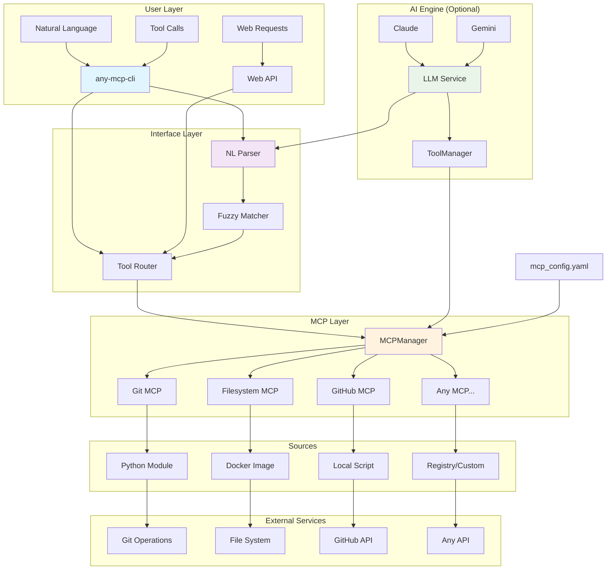

# any-mcp

A universal adapter that safely starts any MCP package, discovers available tools, and provides a unified interface for users and LLMs to interact with them through a single, standardized API.

## Mission

Build **one adapter layer** that lets LLMs plug-and-play with *any* third-party MCP found on the internet—no bespoke coding required each time.

## Key Features

- **Natural Language Interface**: Talk to any MCP using plain English - no API knowledge needed
- **Universal Adapter**: One interface for all MCPs regardless of underlying implementation
- **Auto-Discovery**: Automatically detect and catalog available tools from any MCP
- **Multi-Source Installation**: Install MCPs from Docker, local files, or registry modules
- **Polished CLI**: Modern command-line interface with subcommands for all operations
- **Web API**: RESTful interface for remote MCP management and tool calling
- **Multi-LLM Support**: Optional LLM-powered chat mode with Claude and Gemini support for advanced natural language processing
- **Production Ready**: Includes configuration management, logging, and cleanup

## Architecture



### Core Components

1. **Natural Language CLI** (`any_mcp_cli.py`) - Polished command-line interface with natural language processing for one-shot tool calls
2. **MCP Manager** (`mcp_manager.py`) - Lifecycle management, health monitoring, and tool orchestration for multiple MCP servers
3. **MCP Client** (`mcp_client.py`) - Enhanced client with complete tool discovery and calling capabilities with robust error handling
4. **MCP Installer** (`mcp_installer.py`) - Multi-source MCP package installer supporting Docker, local files, and Python modules
5. **Web API** (`api/web_mcp.py`) - FastAPI-based HTTP interface for all MCP operations with RESTful endpoints
6. **Multi-LLM Integration** (`core/claude.py`, `core/gemini.py`) - Optional LLM integration supporting both Claude and Gemini for advanced natural language processing and chat
7. **Tool Management** (`core/tools.py`) - Centralized tool discovery and management across all MCPs
8. **Connection Router** (`connect_server.py`) - Flexible server connection interface for various MCP sources

## Quick Start

### Installation

```bash
# Install dependencies
pip install -e .

# Copy example configuration
cp example_mcp_config.yaml mcp_config.yaml

# Set environment variables (optional)
export GITHUB_TOKEN=your_github_token_here
export USE_UV=1  # Use uv for faster Python execution
```

### Basic Usage

#### 1. Natural Language CLI (Recommended)

```bash
# One-shot natural language tool call (local MCP)
python any_mcp_cli.py nl --script mcp_server.py --query "read the plan: doc_id=plan.md"

# Call external MCP with natural language
python any_mcp_cli.py nl --module mcp_server_git --module-args "--repository ." --query "show git status repo_path=."

# Explicit tool calls
python any_mcp_cli.py call --script mcp_server.py --tool read_document --args doc_id=plan.md
python any_mcp_cli.py call --module mcp_server_git --tool git_status --args repo_path=.

# Interactive chat (requires Claude or Gemini API key)
python any_mcp_cli.py chat --script mcp_server.py
```

#### 2. Server Management

```bash
# List configured servers
python any_mcp_cli.py list

# Install and configure MCPs
python any_mcp_cli.py install --name docs --source local://mcp_server.py --desc "Document operations"
python any_mcp_cli.py install --name git --source docker://git-mcp-image --desc "Git operations"

# Start/stop servers
python any_mcp_cli.py start --server docs
python any_mcp_cli.py tools --server docs
python any_mcp_cli.py stop --server docs
```

#### 3. Web API Server

```bash
# Start the web API server
python -m api.web_mcp

# Or use uvicorn directly
uvicorn api.web_mcp:app --host 0.0.0.0 --port 8000 --reload
```

#### 4. Programmatic Usage

```python
from mcp_manager import MCPManager
from mcp_installer import MCPInstaller

# Install an MCP
installer = MCPInstaller()
installer.install_mcp(
    name="github",
    source="docker://ghcr.io/github/github-mcp-server",
    env_vars={"GITHUB_TOKEN": "your_token"}
)

# Use the MCP
async with MCPManager() as manager:
    # List available tools
    tools = await manager.list_mcp_tools("github")
    
    # Call a tool
    result = await manager.call_mcp(
        "github", 
        "search_repositories", 
        {"query": "mcp language:python"}
    )
```

### Web API Examples

```bash
# List all MCPs
curl http://localhost:8000/mcp

# Install a new MCP
curl -X POST http://localhost:8000/mcp/install \
  -H "Content-Type: application/json" \
  -d '{
    "name": "calculator",
    "source": "local://./demos/mcp_calc_server.py",
    "description": "Calculator MCP for math operations"
  }'

# Call a tool
curl -X POST http://localhost:8000/mcp/calculator/call \
  -H "Content-Type: application/json" \
  -d '{
    "tool_name": "add",
    "args": {"a": 5, "b": 3}
  }'

# Check MCP health
curl http://localhost:8000/mcp/calculator/health
```

## Configuration

Create a `mcp_config.yaml` file to define your MCPs:

```yaml
installed_mcps:
  github:
    type: "docker"
    source: "ghcr.io/github/github-mcp-server"
    description: "GitHub's official MCP server"
    env_vars:
      GITHUB_PERSONAL_ACCESS_TOKEN: "${GITHUB_TOKEN}"
    enabled: true

  calculator:
    type: "local"
    source: "./demos/mcp_calc_server.py"
    description: "Mathematical operations"
    enabled: true
```

## Supported MCP Sources

### Python Module MCPs
```bash
# Use Python modules directly (recommended for community MCPs)
python any_mcp_cli.py call --module mcp_server_git --tool git_status --args repo_path=.
python any_mcp_cli.py nl --module mcp_server_filesystem --query "list files path=/tmp"
```

### Docker MCPs
```bash
# Install from Docker registry
python any_mcp_cli.py install --name github --source docker://ghcr.io/github/github-mcp-server
python any_mcp_cli.py call --docker ghcr.io/github/github-mcp-server --tool search_repos --args query=python
```

### Local Script MCPs
```bash
# Use local Python scripts
python any_mcp_cli.py call --script mcp_server.py --tool read_document --args doc_id=plan.md
python any_mcp_cli.py nl --script custom_mcp.py --query "process data: input=test.csv"
```

### Registry MCPs (Future)
```bash
# Install from MCP registry (planned)
python any_mcp_cli.py install --name financial --source registry://financial-data-mcp
```

## Examples and Demos

### Quick Start Examples

```bash
# Natural language with local MCP
python any_mcp_cli.py nl --script mcp_server.py --query "read the plan: doc_id=plan.md"

# External Git MCP operations
python -m pip install mcp-server-git
python any_mcp_cli.py call --module mcp_server_git --tool git_status --args repo_path=.

# Community filesystem MCP
python -m pip install mcp-server-filesystem  
python any_mcp_cli.py nl --module mcp_server_filesystem --query "list directory contents path=."

# Docker-based MCP (when available)
python any_mcp_cli.py call --docker mcp/calculator --tool add --args a=5,b=3

# Notion workspace queries
python any_mcp_cli.py nl --script notion_mcp_server.py --query "What are my high priority tasks?"
python any_mcp_cli.py call --script notion_mcp_server.py --tool get_task_tracker_tasks --args status_filter=all
```

### Available Community MCPs

Install and use any MCP from the [official servers repository](https://github.com/modelcontextprotocol/servers):

```bash
# Git operations
pip install mcp-server-git
python any_mcp_cli.py call --module mcp_server_git --tool git_log --args repo_path=.

# Filesystem operations  
pip install mcp-server-filesystem
python any_mcp_cli.py call --module mcp_server_filesystem --tool read_file --args path=README.md

# Database operations
pip install mcp-server-sqlite
python any_mcp_cli.py call --module mcp_server_sqlite --tool execute_query --args query="SELECT * FROM users"

# Notion workspace integration (included)
python any_mcp_cli.py call --script notion_mcp_server.py --tool get_task_tracker_tasks --args status_filter=in_progress
python any_mcp_cli.py nl --script notion_mcp_server.py --query "Show me my course notes"
```

## Error Handling and Resilience

The system includes comprehensive error handling:

- **Custom Exception Types**: Specific exceptions for different error scenarios
- **Retry Logic**: Automatic retries with exponential backoff
- **Circuit Breakers**: Prevent cascading failures
- **Timeout Protection**: Configurable timeouts for all operations
- **Error Aggregation**: Collect and analyze errors for monitoring

## API Documentation

When running the web API, visit:
- **API Docs**: http://localhost:8000/docs
- **ReDoc**: http://localhost:8000/redoc
- **Health Check**: http://localhost:8000/health

## Development

### Project Structure

```
mcp/
├── api/                    # Web API implementation
│   ├── web_mcp.py         # FastAPI application with RESTful endpoints
│   └── __init__.py
├── core/                   # Core functionality
│   ├── chat.py            # Chat interface for LLM interactions
│   ├── claude.py          # Claude API integration
│   ├── gemini.py          # Gemini API integration
│   ├── cli_chat.py        # CLI chat implementation
│   ├── cli.py             # Command line interface
│   ├── tools.py           # Tool management and discovery
│   └── error_handling.py  # Error handling system with circuit breakers
├── demos/                  # Example MCPs and demos
│   ├── calc_demo.py       # Calculator demo
│   ├── github_mcp_demo.py # GitHub MCP demo
│   ├── mcp_calc_server.py # Calculator MCP server
│   ├── real_github_demo.py # Real GitHub integration
│   └── simple_demo.py     # Basic demonstration
├── mcps/                   # Installed local MCPs
├── mcp_client.py          # Enhanced MCP client with tool discovery
├── mcp_installer.py       # Multi-source MCP installation system
├── mcp_manager.py         # MCP lifecycle management and orchestration
├── mcp_server.py          # Document MCP server
├── notion_mcp_server.py   # Notion workspace integration MCP server
├── notion_web_demo.html   # Web interface demo for Notion API
├── main.py                # Main application entry point
├── example_mcp_config.yaml # Example configuration
└── README.md              # This file
```

### Running Tests

```bash
# Install test dependencies
pip install pytest pytest-asyncio

# Run tests
pytest tests/ -v

# Run with coverage
pytest tests/ --cov=. --cov-report=html
```

## Production Deployment

### Environment Variables

```bash
export LLM_PROVIDER=gemini  # or 'claude'
export CLAUDE_MODEL=claude-3-sonnet-20240229
export ANTHROPIC_API_KEY=your_anthropic_key
export GEMINI_MODEL=gemini-1.5-pro
export GEMINI_API_KEY=your_gemini_key
export GITHUB_TOKEN=your_github_token
export USE_UV=1
export LOG_LEVEL=INFO
```

### Docker Deployment

```dockerfile
FROM python:3.11-slim

WORKDIR /app
COPY . .
RUN pip install -e .

EXPOSE 8000
CMD ["uvicorn", "api.web_mcp:app", "--host", "0.0.0.0", "--port", "8000"]
```

### Notion Integration Guide

#### Setting Up Notion MCP Server

The project includes a Notion MCP server (`notion_mcp_server.py`) that enables natural language queries to your Notion workspace.

**1. Get Your Notion Integration Key:**
- Go to [Notion Integrations](https://www.notion.so/my-integrations)
- Create a new integration and copy the key
- Share your databases/pages with the integration

**2. Test Direct Tool Calls:**
```bash
# Activate virtual environment (if not already active)
source .venv/bin/activate

# Get all tasks from your Task Tracker
uv run python3 any_mcp_cli.py call --script notion_mcp_server.py --tool get_task_tracker_tasks --args status_filter=all

# Get tasks by status
uv run python3 any_mcp_cli.py call --script notion_mcp_server.py --tool get_task_tracker_tasks --args status_filter=in_progress

# Get database contents
uv run python3 any_mcp_cli.py call --script notion_mcp_server.py --tool get_database_contents --args database_id=YOUR_DATABASE_ID

# Get specific page content
uv run python3 any_mcp_cli.py call --script notion_mcp_server.py --tool get_page_content --args page_id=YOUR_PAGE_ID
```

**3. Enable Natural Language Queries:**

Create a `.env` file with your LLM provider:
```bash
# For Gemini (recommended - free tier available)
echo "LLM_PROVIDER=gemini" > .env
echo "GEMINI_API_KEY=your_gemini_api_key_here" >> .env

# OR for Claude
echo "LLM_PROVIDER=claude" > .env
echo "ANTHROPIC_API_KEY=your_anthropic_key_here" >> .env
```

**4. Use Natural Language Queries:**
```bash
# Ask questions in plain English
uv run python3 any_mcp_cli.py nl --script notion_mcp_server.py --query "What are my high priority tasks due this month?"

uv run python3 any_mcp_cli.py nl --script notion_mcp_server.py --query "Show me all my course notes from COMP20008"

uv run python3 any_mcp_cli.py nl --script notion_mcp_server.py --query "What goals do I have that are marked as done?"
```

**5. Interactive Chat Mode:**
```bash
# Start interactive session with Notion
uv run python3 any_mcp_cli.py chat --script notion_mcp_server.py
```

**6. Web API Access:**

Start the web server:
```bash
# Start web server
uv run python3 -m api.web_mcp
```

**RESTful API Endpoints:**
```bash
# Check API health
curl http://localhost:8000/health

# List all MCPs
curl http://localhost:8000/mcp

# List tools for specific MCP
curl http://localhost:8000/mcp/notion_custom/tools

# Call Notion tools via HTTP
curl -X POST http://localhost:8000/mcp/notion_custom/call \
  -H "Content-Type: application/json" \
  -d '{"tool_name": "get_task_tracker_tasks", "args": {"status_filter": "all"}}'

# Get high priority tasks
curl -X POST http://localhost:8000/mcp/notion_custom/call \
  -H "Content-Type: application/json" \
  -d '{"tool_name": "get_task_tracker_tasks", "args": {"status_filter": "in_progress"}}'

# Query specific database
curl -X POST http://localhost:8000/mcp/notion_custom/call \
  -H "Content-Type: application/json" \
  -d '{"tool_name": "get_database_contents", "args": {"database_id": "YOUR_DATABASE_ID"}}'

# Search Notion content
curl -X POST http://localhost:8000/mcp/notion_custom/call \
  -H "Content-Type: application/json" \
  -d '{"tool_name": "search_notion", "args": {"query": "MCP", "filter_type": "page"}}'
```

**Web Interface Demo:**
Open `notion_web_demo.html` in your browser for an interactive web interface to test the API.

**JavaScript/Web Integration:**
```javascript
// Example web app integration
async function getMyTasks() {
    const response = await fetch('http://localhost:8000/mcp/notion_custom/call', {
        method: 'POST',
        headers: { 'Content-Type': 'application/json' },
        body: JSON.stringify({
            tool_name: 'get_task_tracker_tasks',
            args: { status_filter: 'all' }
        })
    });
    const data = await response.json();
    const tasks = JSON.parse(data.data.content[0].text);
    return tasks;
}
```

**Available Notion Tools:**
- `search_notion` - Search across all accessible content
- `get_database_contents` - Get contents from a specific database
- `get_page_content` - Get content of a specific page
- `get_task_tracker_tasks` - Get tasks with status filtering

### Health Monitoring

The system provides comprehensive health monitoring:

```bash
# Check overall system health
curl http://localhost:8000/health

# Check specific MCP health
curl http://localhost:8000/mcp/github/health

# Get detailed status of all MCPs
curl http://localhost:8000/mcp
```


## Contributing

1. Fork the repository
2. Create a feature branch (`git checkout -b feature/amazing-feature`)
3. Commit your changes (`git commit -m 'Add amazing feature'`)
4. Push to the branch (`git push origin feature/amazing-feature`)
5. Open a Pull Request

## License

This project is licensed under the MIT License - see the [LICENSE](LICENSE) file for details.

## Support

For questions and support:
- Create an issue on GitHub
- Check the [API documentation](http://localhost:8000/docs) when running the server
- Review the example configurations and demos
