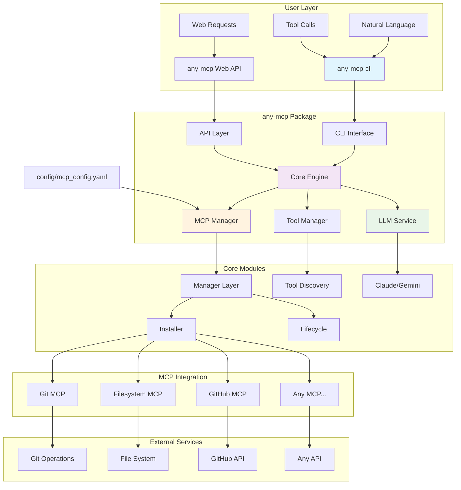

# any-mcp

A universal adapter that safely starts any MCP package, discovers available tools, and provides a unified interface for users and LLMs to interact with them through a single, standardized API.

> **First Production Release v1.0.0** - Ready for LLMgine integration with full MCP protocol compliance, multi-LLM support, and production-ready deployment.

## Mission

Build **one adapter layer** that lets LLMs plug-and-play with *any* third-party MCP found on the internet—no bespoke coding required each time.

## Key Features

- **Natural Language Interface**: Talk to any MCP using plain English - no API knowledge needed
- **Universal Adapter**: One interface for all MCPs regardless of underlying implementation
- **Auto-Discovery**: Automatically detect and catalog available tools from any MCP
- **Multi-Source Installation**: Install MCPs from Docker, local files, or registry modules
- **Polished CLI**: Modern command-line interface with subcommands for all operations
- **Web API**: RESTful interface for remote MCP management and tool calling
- **Multi-LLM Support**: Optional LLM-powered chat mode with Claude and Gemini support for advanced natural language processing
- **Production Ready**: Includes configuration management, logging, and cleanup

## Architecture



### Core Components

1. **CLI Interface** (`any_mcp/cli/main.py`) - Command-line interface with natural language processing for tool calls
2. **Core Engine** (`any_mcp/main.py`) - Main application logic and MCP orchestration
3. **MCP Manager** (`any_mcp/managers/manager.py`) - Lifecycle management, health monitoring, and tool orchestration
4. **MCP Installer** (`any_mcp/managers/installer.py`) - Multi-source MCP package installer (Docker, local files, Python modules)
5. **MCP Client** (`any_mcp/core/client.py`) - Enhanced client with tool discovery and calling capabilities
6. **Web API** (`any_mcp/api/web_mcp.py`) - FastAPI-based HTTP interface for remote MCP operations
7. **LLM Integration** (`any_mcp/core/claude.py`, `any_mcp/core/gemini.py`) - Claude and Gemini support for natural language processing
8. **Tool Management** (`any_mcp/core/tools.py`) - Centralized tool discovery and management across all MCPs
9. **Chat Interface** (`any_mcp/core/chat.py`, `any_mcp/core/cli_chat.py`) - LLM-powered chat and conversation management
10. **Server Connector** (`any_mcp/servers/connect_server.py`) - Flexible server connection interface

## Quick Start

### Installation

```bash
# Clone the repository
git clone https://github.com/chi-n-nguyen/any-mcp.git
cd any-mcp

# Install dependencies
pip install -e .

# Copy example configuration
cp config/example_mcp_config.yaml config/mcp_config.yaml

# Set environment variables (optional)
export GITHUB_TOKEN=your_github_token_here
export USE_UV=1  # Use uv for faster Python execution

### Using the Rich Notion MCP CLI

Experience a beautiful, interactive interface for your Notion MCP:

```bash
# Run the rich CLI
python3 notion_cli.py

# Available commands:
#   search <query> - Search across Notion content
#   page <id> - Get page content details
#   health - Check connection status
#   help - Show available tools
#   quit - Exit CLI
```

The rich CLI features:
- 🎨 **Beautiful UI**: Colorful tables, panels, and status indicators
- 📊 **Rich Tables**: Formatted search results with pagination
- 🔍 **Interactive Search**: Real-time search across your Notion workspace
- 📄 **Page Details**: Rich page information display
- 💚 **Health Monitoring**: Connection status with user details

### Quick Start with v1.0.0 Release

```bash
# Download the latest release
wget https://github.com/chi-n-nguyen/any-mcp/archive/refs/tags/v1.0.0.tar.gz
tar -xzf v1.0.0.tar.gz
cd any-mcp-1.0.0

# Install and run
pip install -e .
python main.py
```

### Basic Usage

#### 1. Natural Language CLI (Recommended)

```bash
# Natural language tool call via configured MCPs
any-mcp-cli nl --module mcp_server_git --query "show git status repo_path=."

# Explicit tool calls
any-mcp-cli call --module mcp_server_git --tool git_status --args repo_path=.

# Interactive chat (requires Claude or Gemini API key)
any-mcp-cli chat --module mcp_server_git
```

#### 2. Server Management

```bash
# List configured servers
any-mcp-cli list

# Install and configure MCPs
any-mcp-cli install --name docs --source local://my_mcp.py --desc "Document operations"
any-mcp-cli install --name git --source docker://git-mcp-image --desc "Git operations"

# Start/stop servers
any-mcp-cli start --server docs
any-mcp-cli tools --server docs
any-mcp-cli stop --server docs
```

#### 3. Web API Server

```bash
# Start the web API server
python -m any_mcp.api.web_mcp

# Or use uvicorn directly
uvicorn any_mcp.api.web_mcp:app --host 0.0.0.0 --port 8000 --reload
```

#### 4. Programmatic Usage

```python
from any_mcp.managers.manager import MCPManager
from any_mcp.managers.installer import MCPInstaller

# Install an MCP
installer = MCPInstaller()
installer.install_mcp(
    name="github",
    source="docker://ghcr.io/github/github-mcp-server",
    env_vars={"GITHUB_TOKEN": "your_token"}
)

# Use the MCP
async with MCPManager() as manager:
    # List available tools
    tools = await manager.list_mcp_tools("github")
    
    # Call a tool
    result = await manager.call_mcp(
        "github", 
        "search_repositories", 
        {"query": "mcp language:python"}
    )
```

### Web API Examples

```bash
# List all MCPs
curl http://localhost:8000/mcp

# Install a new MCP (example: Git MCP)
curl -X POST http://localhost:8000/mcp/install \
  -H "Content-Type: application/json" \
  -d '{
    "name": "git",
    "source": "module://mcp_server_git",
    "description": "Git operations via MCP"
  }'

# Call a tool (example)
curl -X POST http://localhost:8000/mcp/git/call \
  -H "Content-Type: application/json" \
  -d '{
    "tool_name": "git_status",
    "args": {"repo_path": "."}
  }'

# Check MCP health
curl http://localhost:8000/mcp/git/health
```

## Configuration

Create a `config/mcp_config.yaml` file to define your MCPs:

```yaml
installed_mcps:
  github:
    type: "docker"
    source: "ghcr.io/github/github-mcp-server"
    description: "GitHub's official MCP server"
    env_vars:
      GITHUB_PERSONAL_ACCESS_TOKEN: "${GITHUB_TOKEN}"
    enabled: true

  # Add your custom MCPs here
  # my_mcp:
  #   type: "local"
  #   source: "./my_custom_mcp.py"
  #   description: "My custom MCP server"
  #   enabled: true
```

## Supported MCP Sources

### Python Module MCPs
```bash
# Use Python modules directly (recommended for community MCPs)
any-mcp-cli call --module mcp_server_git --tool git_status --args repo_path=.
any-mcp-cli nl --module mcp_server_filesystem --query "list files path=/tmp"
```

### Docker MCPs
```bash
# Install from Docker registry
any-mcp-cli install --name github --source docker://ghcr.io/github/github-mcp-server
any-mcp-cli call --docker ghcr.io/github/github-mcp-server --tool search_repos --args query=python
```

### Local Script MCPs
```bash
# Use local Python scripts
any-mcp-cli call --script my_local_mcp.py --tool read_document --args doc_id=plan.md
any-mcp-cli nl --script custom_mcp.py --query "process data: input=test.csv"
```

### Registry MCPs (Future)
```bash
# Install from MCP registry (planned)
python any_mcp_cli.py install --name financial --source registry://financial-data-mcp
```

## Examples and Demos

### Quick Start Examples

```bash
# External Git MCP operations
python -m pip install mcp-server-git
any-mcp-cli call --module mcp_server_git --tool git_status --args repo_path=.

# Community filesystem MCP
python -m pip install mcp-server-filesystem  
any-mcp-cli nl --module mcp_server_filesystem --query "list directory contents path=."
```

### Available Community MCPs

Install and use any MCP from the [official servers repository](https://github.com/modelcontextprotocol/servers):

```bash
# Git operations
pip install mcp-server-git
python any_mcp_cli.py call --module mcp_server_git --tool git_log --args repo_path=.

# Filesystem operations  
pip install mcp-server-filesystem
python any_mcp_cli.py call --module mcp_server_filesystem --tool read_file --args path=README.md

# Database operations
pip install mcp-server-sqlite
python any_mcp_cli.py call --module mcp_server_sqlite --tool execute_query --args query="SELECT * FROM users"

# Notion workspace integration (via official Notion MCP)
# 1) Ensure `config/mcp_config.yaml` has the `notion` server (see Configuration section)
# 2) Set the NOTION_API_TOKEN/NOTION_API_KEY env vars
# 3) List tools and call one
any-mcp-cli list
any-mcp-cli tools --server notion
any-mcp-cli call --server notion --tool TOOL_NAME --args key=value
any-mcp-cli nl --server notion --query "search query=project notes"
```

## Error Handling and Resilience

The system includes comprehensive error handling:

- **Custom Exception Types**: Specific exceptions for different error scenarios
- **Retry Logic**: Automatic retries with exponential backoff
- **Circuit Breakers**: Prevent cascading failures
- **Timeout Protection**: Configurable timeouts for all operations
- **Error Aggregation**: Collect and analyze errors for monitoring

## API Documentation

When running the web API, visit:
- **API Docs**: http://localhost:8000/docs
- **ReDoc**: http://localhost:8000/redoc
- **Health Check**: http://localhost:8000/health

## Building Your Own MCP Server

### Using the Notion MCP Example

The repository includes a complete Notion MCP implementation at `examples/notion_mcp_server.py` that serves as a comprehensive template for building your own MCP servers. This example demonstrates all the essential patterns and best practices. 

**Try the Rich CLI**: Run `python3 notion_cli.py` for a beautiful, interactive interface to test your Notion MCP!

#### Key Components Demonstrated

1. **Server Setup and JSON-RPC Handling**
   - Proper MCP protocol implementation
   - Tool registration and discovery
   - Request routing and error handling

2. **External API Integration**
   - Environment variable configuration
   - HTTP client setup with proper headers
   - API error handling and response parsing

3. **Tool Implementation Patterns**
   - Input validation and schema definition
   - Async operation handling
   - Structured response formatting

#### Following the Example

**Step 1: Copy the Template**
```bash
cp examples/notion_mcp_server.py examples/your_service_mcp_server.py
```

**Step 2: Modify for Your Service**
- Replace Notion API calls with your service's API
- Update tool definitions in `__init__`
- Modify authentication headers and endpoints
- Implement your specific business logic

**Step 3: Test Your Implementation**
```bash
# Set your service's environment variables
export YOUR_SERVICE_API_KEY=your_api_key

# Test with any-mcp-cli
any-mcp-cli call --script examples/your_service_mcp_server.py --tool your_tool --args key=value
```

#### Common Patterns to Follow

**Tool Registration:**
```python
self.tools = [
    {
        "name": "your_tool_name",
        "description": "Clear description of what this tool does",
        "inputSchema": {
            "type": "object",
            "properties": {
                "required_param": {
                    "type": "string",
                    "description": "Description of this parameter"
                }
            },
            "required": ["required_param"]
        }
    }
]
```

**API Integration:**
```python
async def your_tool_method(self, param: str) -> Dict[str, Any]:
    """Your tool implementation."""
    try:
        response = requests.get(
            f"{YOUR_API_BASE_URL}/endpoint",
            headers=self.get_headers(),
            timeout=30
        )
        
        if response.status_code == 200:
            return {
                "success": True,
                "data": response.json()
            }
        else:
            return {
                "error": f"API error: {response.status_code}",
                "details": response.text
            }
    except Exception as e:
        return {"error": f"Request failed: {str(e)}"}
```

**Request Handling:**
```python
elif method == "tools/call":
    tool_name = params.get("name")
    arguments = params.get("arguments", {})
    
    if tool_name == "your_tool":
        result = await self.your_tool_method(arguments.get("param"))
    else:
        # Handle unknown tool error
```

#### Services to Implement

Use the Notion example as a template for these common integrations:

**Communication Platforms:**
- Slack MCP (channels, messages, users)
- Discord MCP (servers, channels, webhooks)
- Microsoft Teams MCP (teams, channels, chats)

**Project Management:**
- Jira MCP (issues, projects, boards)
- Linear MCP (issues, teams, projects)
- GitHub Issues MCP (issues, PRs, repositories)

**Databases:**
- PostgreSQL MCP (queries, schema, data)
- MongoDB MCP (collections, documents, aggregations)
- Redis MCP (keys, values, pub/sub)

**Cloud Services:**
- AWS MCP (EC2, S3, Lambda)
- GCP MCP (Compute, Storage, Functions)
- Azure MCP (VMs, Blob Storage, Functions)

#### Testing Your MCP

1. **Unit Testing**: Test individual tool methods
2. **Integration Testing**: Test with `any-mcp-cli`
3. **End-to-End Testing**: Test through the web API

```bash
# Test tool listing
any-mcp-cli call --script examples/your_mcp.py --tool health_check

# Test specific functionality
any-mcp-cli call --script examples/your_mcp.py --tool your_main_tool --args param=test

# Test with natural language
any-mcp-cli nl --script examples/your_mcp.py --query "do something with test data"
```

## Development

### Project Structure

```
any_mcp/
├── any_mcp/
│   ├── api/               # Web API implementation
│   │   └── web_mcp.py
│   ├── core/              # Core functionality
│   │   ├── chat.py
│   │   ├── claude.py
│   │   ├── gemini.py
│   │   ├── cli_chat.py
│   │   ├── cli.py
│   │   ├── tools.py
│   │   └── error_handling.py
│   ├── managers/          # MCP lifecycle & installation
│   │   ├── manager.py
│   │   └── installer.py
│   ├── servers/
│   │   └── connect_server.py
│   └── cli/
│       └── main.py
├── config/
│   └── mcp_config.yaml
├── main.py                # Entry point
├── README.md
├── LICENSE
└── VERSION
```

## Release Notes

### v1.0.0 - First Production Release (2025-01-08)

**Major Milestone**: First stable release ready for production deployment and LLMGine integration.

** New Features:**
- Universal MCP adapter with auto-discovery and tool orchestration
- Multi-LLM support for Claude and Gemini with unified interface
- Natural language processing for any MCP without API knowledge
- RESTful Web API with comprehensive endpoints for remote management
- Works seamlessly with the official Notion MCP (via NPX) for workspace operations
- Production-ready configuration management and health monitoring
- LLMGine-compatible deployment with secure environment handling

** Technical Improvements:**
- Standard MCP protocol compliance for seamless integration
- Health check endpoints for monitoring and diagnostics
- Secure environment variable configuration (no hardcoded secrets)
- Docker and local deployment support with launcher scripts
- Comprehensive error handling and logging throughout the stack
- Multi-source MCP installation (Docker, local files, Python modules)

** Documentation:**
- Complete setup and deployment guides
- LLMGine integration instructions with configuration examples
- API documentation with cURL examples and JavaScript integration
- Security best practices and environment variable management

**🔒 Security:**
- All sensitive data moved to environment variables
- Git history cleaned of any hardcoded secrets
- Production-ready secret management practices

This release establishes any-mcp as a stable, production-ready platform for MCP integration with modern LLM systems.

## License

This project is licensed under the MIT License - see the [LICENSE](LICENSE) file for details.


### Running Tests

```bash
# Install test dependencies
pip install pytest pytest-asyncio

# Run tests
pytest tests/ -v

# Run with coverage
pytest tests/ --cov=. --cov-report=html
```

## Production Deployment

### Environment Variables

```bash
export LLM_PROVIDER=gemini  # or 'claude'
export CLAUDE_MODEL=claude-3-sonnet-20240229
export ANTHROPIC_API_KEY=your_anthropic_key
export GEMINI_MODEL=gemini-1.5-pro
export GEMINI_API_KEY=your_gemini_key
export GITHUB_TOKEN=your_github_token
export USE_UV=1
export LOG_LEVEL=INFO
```

### Docker Deployment

```dockerfile
FROM python:3.11-slim

WORKDIR /app
COPY . .
RUN pip install -e .

EXPOSE 8000
CMD ["uvicorn", "any_mcp.api.web_mcp:app", "--host", "0.0.0.0", "--port", "8000"]
```

#### Setting Up Notion MCP (official server)

The adapter works out of the box with the official Notion MCP published by Notion.

**1) Create a Notion integration and get a token:**
- Visit the Notion Integrations page and create an internal integration
- Share databases/pages with that integration
- Export your secret as an environment variable (names supported by different Notion releases vary):
  ```bash
  export NOTION_API_TOKEN=your_secret
  # or
  export NOTION_API_KEY=your_secret
  ```

**2) Configure any-mcp to start the Notion server:**
Ensure your `config/mcp_config.yaml` contains the `notion` entry:
```yaml
installed_mcps:
  notion:
    type: "local"
    source: "npx -y @notionhq/notion-mcp-server"
    description: "Official Notion MCP Server"
    env_vars:
      NOTION_API_TOKEN: "${NOTION_API_TOKEN}"
      NOTION_API_KEY: "${NOTION_API_KEY}"
    enabled: true
```

**3) List tools and run commands:**
```bash
any-mcp-cli list
any-mcp-cli tools --server notion
any-mcp-cli call --server notion --tool TOOL_NAME --args key=value
any-mcp-cli nl --server notion --query "search query=project notes"
```

Tool names come from the official server and may change across versions. Use `tools` to discover the available operations.

**4) Web API Access:**

Start the API server:
```bash
python -m any_mcp.api.web_mcp
```

Call through HTTP:
```bash
# Check API health
curl http://localhost:8000/health

# List all MCPs
curl http://localhost:8000/mcp

# List tools for Notion
curl http://localhost:8000/mcp/notion/tools

# Call a Notion tool (replace TOOL_NAME and args)
curl -X POST http://localhost:8000/mcp/notion/call \
  -H "Content-Type: application/json" \
  -d '{"tool_name": "TOOL_NAME", "args": {"key": "value"}}'
```

### Health Monitoring

The system provides comprehensive health monitoring:

```bash
# Check overall system health
curl http://localhost:8000/health

# Check specific MCP health
curl http://localhost:8000/mcp/github/health

# Get detailed status of all MCPs
curl http://localhost:8000/mcp
```


## Contributing

1. Fork the repository
2. Create a feature branch (`git checkout -b feature/amazing-feature`)
3. Commit your changes (`git commit -m 'Add amazing feature'`)
4. Push to the branch (`git push origin feature/amazing-feature`)
5. Open a Pull Request

## License

This project is licensed under the MIT License - see the [LICENSE](LICENSE) file for details.

## Support

For questions and support:
- Create an issue on GitHub
- Check the [API documentation](http://localhost:8000/docs) when running the server
- Review the example configurations and demos
