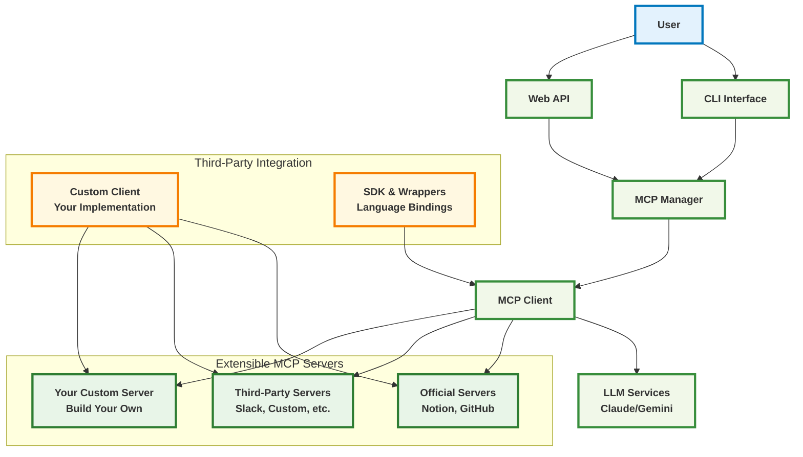

# Any-MCP: Universal MCP Client Framework

A production-ready, universal Model Context Protocol (MCP) client that seamlessly integrates with multiple MCP servers. Built for AI developers who want to focus on integration excellence rather than building everything from scratch.

## Production Release v1.0.0

**Any-MCP** is a polished, production-ready framework that transforms how you work with MCP servers. Instead of building custom MCP servers, focus on creating amazing user experiences by integrating the best existing servers.

## Key Features

- **Universal MCP Client**: Connect to any MCP server (Docker, local, registry)
- **Third-Party Extensible**: Build custom MCP clients and servers
- **Rich Interactive CLI**: Beautiful, intuitive command-line interface
- **Web API**: RESTful API for programmatic access
- **Multi-LLM Support**: Claude, Gemini, and custom LLM integrations
- **Plugin Architecture**: Extensible framework for third-party tools
- **Auto-discovery**: Automatically detect and configure MCP servers
- **Production Ready**: Error handling, logging, health checks
- **Complete Notion Integration**: Official Notion MCP server with 30+ tools
- **Community Ecosystem**: Support for third-party MCP servers and clients

## Core Components

### CLI Commands
- `list` - Show all configured MCP servers and their status
- `install` - Install MCP servers from various sources
- `start` - Start an MCP server
- `stop` - Stop an MCP server
- `tools` - List available tools from an MCP server
- `call` - Execute a specific tool
- `chat` - Interactive chat with MCP servers
- `nl` - Natural language interface

### Installer Sources
- **Local Script**: `local://./path/to/script.py`
- **Docker Image**: `docker://image:tag`
- **Registry**: `registry://name` (coming soon)

## Architecture

Any-MCP is built with extensibility at its core, designed to support third-party integrations at every level:

### Architecture Diagram



### Third-Party Integration Points

#### **Custom MCP Clients**
- Build your own MCP client implementations
- Use the provided Client SDK and API wrappers
- Integrate with existing applications via Web API
- Language bindings for Python, JavaScript, and more

#### **Custom MCP Servers** 
- Create domain-specific MCP servers for your use case
- Examples: Slack, Discord, databases, analytics tools
- Use any programming language that supports MCP protocol
- Register in the community MCP registry

#### **Plugin Architecture**
- Extend core functionality with plugins
- Custom protocol adapters for proprietary systems
- Third-party LLM model integrations
- Custom UI implementations

### Core Architecture Layers

1. **User Interface Layer**: CLI, Web API, Custom UIs
2. **Application Layer**: Chat systems, tool orchestration  
3. **LLM Services**: Claude, Gemini, Custom models
4. **MCP Management**: Lifecycle, health, plugin management
5. **MCP Core**: Extensible client framework with protocol adapters
6. **Server Ecosystem**: Official and third-party MCP servers

### Extensibility Examples

**Enterprise Integration:**
```python
# Custom enterprise MCP client
from any_mcp import MCPClient, ProtocolAdapter

class EnterpriseClient(MCPClient):
    def __init__(self, internal_api_endpoint):
        super().__init__(custom_adapter=EnterpriseAdapter())
```

**Third-Party Server:**
```yaml
# mcp_config.yaml
installed_mcps:
  slack-integration:
    type: "docker"
    source: "community/slack-mcp-server:latest"
    description: "Community-built Slack MCP server"
    env_vars:
      SLACK_TOKEN: "${SLACK_BOT_TOKEN}"
    enabled: true
```

**Custom Protocol:**
```python
# Custom protocol adapter
class CustomProtocolAdapter(ProtocolAdapter):
    async def handle_custom_protocol(self, message):
        # Your custom protocol logic
        return await self.process_message(message)
```

## Installation

```bash
# Clone the repository
git clone https://github.com/chi-n-nguyen/any-mcp.git
cd any-mcp

# Activate virtual environment
source .venv/bin/activate

# Install dependencies
pip install -r requirements.txt
```

## Configuration

Create a `config/mcp_config.yaml` file to define your MCPs. The system comes with pre-configured examples:

```yaml
installed_mcps:
  notion-official:
    type: "local"
    source: "/opt/homebrew/bin/notion-mcp-server"
    description: "Official Notion MCP server with full API access"
    env_vars:
      NOTION_TOKEN: "${NOTION_API_TOKEN}"
    enabled: true
    
  calculator:
    type: "local"
    source: "./mcps/demo_calculator.py"
    description: "Simple calculator MCP server for testing"
    env_vars: {}
    enabled: true
```

## Environment Variables

Create a `.env` file with your API tokens:

```bash
# Notion Integration
export NOTION_API_TOKEN="your_notion_token_here"

# Discord Integration (optional)
export DISCORD_TOKEN="your_discord_token_here"
```

## Basic Usage

### List Configured MCPs
```bash
python3 -m any_mcp.cli.main list
```

### View Available Tools
```bash
python3 -m any_mcp.cli.main tools --server notion-official
python3 -m any_mcp.cli.main tools --server calculator
```

### Execute Tools
```bash
# Calculator operations
python3 -m any_mcp.cli.main call --server calculator --tool add --args a=15,b=27
python3 -m any_mcp.cli.main call --server calculator --tool power --args base=2,exponent=8

# Notion operations (requires valid token)
python3 -m any_mcp.cli.main call --server notion-official --tool API-get-self
```

### Interactive Chat
```bash
python3 -m any_mcp.cli.main chat --server calculator
```

## Supported MCP Sources

### 1. Local Script
```bash
python3 -m any_mcp.cli.main install --name my-mcp --source local://./mcps/my_server.py
```

### 2. Docker Image
```bash
python3 -m any_mcp.cli.main install --name notion-docker --source docker://mcp/notion
```

### 3. Python Module
```bash
python3 -m any_mcp.cli.main install --name notion-module --source module://@notionhq/notion-mcp-server
```

### 4. Configured Server
```bash
# Use servers defined in config/mcp_config.yaml
python3 -m any_mcp.cli.main start notion-official
```

## Examples and Demos

### Flagship Notion Demo
The system includes full integration with the official Notion MCP server:
- 30+ professional Notion tools
- Full API access (pages, databases, comments, blocks)
- Production-ready with 3k+ stars on GitHub

### Calculator Demo
Built-in calculator MCP for testing and demonstrations:
- Basic operations: add, subtract, multiply, divide
- Advanced: power function
- Perfect for testing MCP integrations

## Project Structure

```
any-mcp/
├── any_mcp/                 # Core framework
│   ├── cli/                # Command-line interface
│   ├── core/               # Core functionality
│   ├── managers/           # MCP lifecycle management
│   └── servers/            # Server connection handling
├── config/                 # MCP configuration files
├── mcps/                   # Local MCP server examples
├── examples/               # Integration examples
└── tests/                  # Test suite
```

## Development

### Adding New MCP Servers
1. Find an MCP server (GitHub, NPM, Docker Hub)
2. Install it locally or via package manager
3. Add configuration to `config/mcp_config.yaml`
4. Set required environment variables
5. Test the integration

### Building Custom MCP Servers
While the focus is on integration, you can build custom servers:
- See `examples/notion_mcp_server.py` for a complete example
- Follow MCP protocol specifications
- Use the built-in testing tools

## Release Notes

### v1.0.0 - Production Release
- Production-ready MCP client framework
- Official Notion MCP integration
- Rich interactive CLI with 8 commands
- Web API for programmatic access
- Multi-LLM support (Claude, Gemini)
- Comprehensive error handling and logging
- Health checks and monitoring
- Auto-discovery and configuration management

## Contributing

1. Fork the repository
2. Create a feature branch
3. Make your changes
4. Add tests
5. Submit a pull request

## License

This project is licensed under the MIT License.

## Support

- **Issues**: GitHub Issues
- **Documentation**: This README and inline code comments
- **Examples**: See `examples/` directory for working integrations

---

**Any-MCP**: Focus on integration excellence rather than building everything from scratch.
